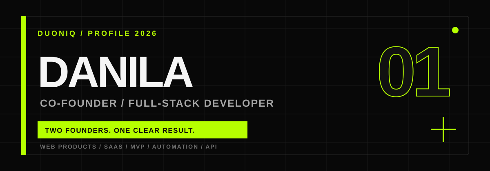

<p align="center">
  
</p>

<p align="center">
  <a href="https://t.me/rchmanoffc"></a>
  <a href="mailto:danrichevv@vk.com"></a>
  <a href="https://github.com/richmanstudio"></a>
</p>

## `01 / ABOUT`

I am **Danila**, a full-stack developer and co-founder of **DUONIQ** — a product engineering studio focused on practical digital systems with a clear business result.

I design and build products end to end: from product logic and interface architecture to backend APIs, databases, integrations, deployment and production support.

```text
DUONIQ
Two founders. One clear result.

Websites          SaaS / MVP          Web applications
CRM systems       Telegram products   AI & automation
API integrations  Payments            Internal tools
```

My current focus is on scalable web products, business automation, LegalTech, developer tools and systems that replace repetitive manual work.

## `02 / SELECTED WORK`

<table>
  <tr>
    <td width="50%" valign="top">
      <h3><a href="https://github.com/richmanstudio/resportal">RESPORTAL</a></h3>
      <p>SaaS workspace for private lawyers and small legal teams: clients, cases, documents, deadlines, employees and subscriptions.</p>
      <code>React</code> <code>TypeScript</code> <code>Express</code> <code>PostgreSQL</code> <code>Prisma</code> <code>Docker</code>
    </td>
    <td width="50%" valign="top">
      <h3><a href="https://github.com/richmanstudio/go-deploy">GO-DEPLOY</a></h3>
      <p>Production-oriented CLI for automated SSH deployments with YAML pipelines, dry-run mode and rollback on failure.</p>
      <code>Go</code> <code>SSH</code> <code>YAML</code> <code>GitHub Actions</code> <code>Docker</code>
    </td>
  </tr>
  <tr>
    <td width="50%" valign="top">
      <h3><a href="https://github.com/richmanstudio/bookverse">BOOKVERSE</a></h3>
      <p>A social product for readers with bookshelves, reviews, activity feeds, statistics, achievements and book discovery.</p>
      <code>FastAPI</code> <code>React</code> <code>PostgreSQL</code> <code>SQLAlchemy</code> <code>Docker</code>
    </td>
    <td width="50%" valign="top">
      <h3><a href="https://github.com/richmanstudio/polza-agency-test-task">POLZA COMPANIES</a></h3>
      <p>Reliable data import and company catalogue with deduplication, indexed search, analytics and server-rendered UI.</p>
      <code>Next.js</code> <code>React</code> <code>TypeScript</code> <code>PostgreSQL</code> <code>Vitest</code>
    </td>
  </tr>
  <tr>
    <td width="50%" valign="top">
      <h3><a href="https://github.com/richmanstudio/nordiktz">ASYNC LEAD BOT</a></h3>
      <p>Fault-tolerant Telegram lead collection with async CRM delivery, retries, idempotency, tests and reproducible CI.</p>
      <code>Python</code> <code>aiogram</code> <code>aiohttp</code> <code>SQLite</code> <code>pytest</code>
    </td>
    <td width="50%" valign="top">
      <h3><a href="https://github.com/richmanstudio/tektonikaaa">TEKTONIKA</a></h3>
      <p>Commercial company website delivered and supported in production, with an adaptive interface and structured service catalogue.</p>
      <code>React</code> <code>TypeScript</code> <code>Tailwind CSS</code> <code>Production</code>
    </td>
  </tr>
</table>

## `03 / ENGINEERING STACK`

<p>
  
  
  
  
  
  
  
  
  
  
  
  
</p>

<table>
  <tr>
    <td><strong>Frontend</strong></td>
    <td>React, Next.js, TypeScript, Vite, Tailwind CSS, Framer Motion, React Native</td>
  </tr>
  <tr>
    <td><strong>Backend</strong></td>
    <td>Node.js, Express, FastAPI, REST API, WebSocket, background jobs</td>
  </tr>
  <tr>
    <td><strong>Data</strong></td>
    <td>PostgreSQL, MySQL, Prisma, SQLAlchemy, Redis, SQLite</td>
  </tr>
  <tr>
    <td><strong>Infrastructure</strong></td>
    <td>Docker, Docker Compose, GitHub Actions, Linux, Vercel, CI/CD</td>
  </tr>
  <tr>
    <td><strong>Integrations</strong></td>
    <td>Telegram, payments, external APIs, email, CRM and AI workflows</td>
  </tr>
</table>

## `04 / HOW I WORK`

```text
01  Understand the business process and the real bottleneck
02  Define the smallest useful product and measurable outcome
03  Design the architecture, interfaces and data model
04  Build, test, deploy and document the system
05  Improve it from production feedback instead of assumptions
```

I value clear scope, maintainable architecture, reproducible environments, secure configuration and interfaces that stay simple under real business complexity.

## `05 / GITHUB`

<p align="center">
  
  
</p>

---

<p align="center">
  <strong>BUILDING DIGITAL PRODUCTS THAT REMOVE FRICTION.</strong><br/>
  <sub>DUONIQ · PRODUCT ENGINEERING · 2026</sub>
</p>
